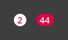

## Contents

* [About](#about)
* [Style: Colors](#colors)
* [Style: Typographhy](#typography)
* [Buttons](#buttons)
* [Modals](#modals)
* [Navigation](#navigation)
* [Information blocks](#information-blocks)
* [Text Forms](#text-forms)
* [Control Elements](#control-elements)
* [Progress & Activity](#progress-and-activity)
* [Badges & Tags](#badges-and-tags)
* [Icons](#icons)
* [Sketch File](#sketch-file)
* [Landing](#landing)


## About


This is a guideline of UI components and their use in developing. It's based on Saberespoder company projects and it includes all the elements the company usually uses for web project. The aim is to simplify further web projects development and to make sure all the projects are in the same corporate style. It includes developing files and .sketch file and can be used by developers and designers. 

For using in developing just add files from /build path to your project.

For building project use [gulp](http://gulpjs.com/).

Please read the license file and provide required references to the company when use the guideline.

## Colors


Since this guideline is intended to use in many web projects, the color palette has a wide range of colors so the projects will not look all the same. For main colors you can choose either green — dark gray combination or light green — dark gray/brown combination. It is also possible to use #3E5262 color as a main and green or red for hints like buttons, headers and icons. 

Avoide to use too many colors in one project to help user to divide content and find the main information. In one project choose main and primary colors, no more than three colors for background including footer, hint color, one or two colors for text and no more than two colors for buttons where one is same to hint/main color.
For buttons use colors from left column for normal states and colors from right column for hover and pressed states. For colorful buttons it's okey to use same colors for hover and pressed states.

All the colors are added as a document colors in .sketch file.

## Typography


This guidline has three font families: Onen Sans, Ropa Sans and Helvetica Neue. Use one of them for each website.
```HTML
<div class="display1">Display text 1</div>
<div class="display2">Display text 2</div>
<h1>Heading 1</h1>
<h2>Heading 2</h2>
<h3>Heading 3</h3>
<h4>Title 1</h4>
<h5>Title 2</h5>
<p>Paragraph text (main). ...</p>
<p class="p2">Paragraph text 2. ...</p>
<p class="caption">Caption text</p>
```
Instead of tags it's possible to use classes:
```HTML
<p class="h1">Heading 1</p>
<p class="h2">Heading 2</p>
<p class="h3">Heading 3</p>
<p class="t1">Title 1</p>
<p class="t2">Title 2</p>
```


## Links


A Hyperlink indicates that the user is moving to a different page and should not be used instead of field label as it might mislead user.

```HTML
<a href="#">Link style</a>
<a class="link-disabled" href="#">Disable link style</a>
<a class="action" href="#">Action button</a>
<a class="action action-next" href="#">Hyperlink with Directional Caret</a>
<a class="action action-next action-disabled" href="#">Hyperlink with Directional Caret Disabled</a>
<a class="action action-prev" href="#">Back</a>
<a class="action action-prev action-disabled" href="#">Back Disabled</a>
```
You also can use class `link`.
```HTML
<span class="link" onclick="...">Link style</span>
```


## Buttons


Buttons should clearly tell the action that will occur when the user touches them.

```HTML
<button>Button</button>
<button>More text Button</button>
<button class="button-disabled">Disabled</button>
```
You also can use class `button`.
```HTML
<div class="button">Button</div>
<div class="button button-disabled">Disabled</div>
```
For big buttons use `button-bg` class. Use big buttons only in leading page. 


```HTML
<button class="button-bg">Big Button</button>
<button class="button-bg">More text Big Button</button>
<button class="button-bg button-disabled">Disabled</button>
```


## Dropdown


Dropdown buttons display multiple choices. The button displays the current state and a down arrow. Do not dublicate content in the button (selected choice) and available choices.

```HTML
<div class="dropdown">
	<input type="hidden" name="user">
	<div class="dropdown-default">Dropdown</div>
	<ul class="dropdown-list" style="display:block;">
		<li class="dropdown-item" data-value="">Option 1</li>
		<li class="dropdown-item" data-value="">Option 2</li>
		<li class="dropdown-item dropdown-item-disabled" data-value="">Option 3 Diasabled</li>
		<li class="dropdown-item" data-value="">Option 4</li>
		<li class="dropdown-item" data-value="">Option 5</li>
	</ul>
</div>
```


```HTML
<div class="state">
	<div class="state-default">State 1</div>
	<ul class="state-list">
		<li class="state-item" data-value="">State 1</li>
		<li class="state-item" data-value="">State 2 wide</li>
		<li class="state-item" data-value="">State 3</li>
		<li class="state-item" data-value="">State 4</li>
	</ul>
</div>
```


# Modals
## Tooltip


Tooltip provides information about an object such as description text for icons or error messages. Tooltip hovers over an element.

```HTML
<div class="tooltip">
	<div class="tooltip-title">This is title</div>
	<div class="tooltip-text">This is some wide description that requires two strokes.</div>
</div>

<div class="tooltip tooltip-bottom">
	<div class="tooltip-title">This is title</div>
	<div class="tooltip-text">This is some wide description that requires two strokes.</div>
</div>
```


## Dialog
Dialog helps to inform users of a change in status, issue or error. Second button is optional.


```HTML
<div class="dialog">
	<div class="dialog-content">
		<div class="dialog-title">Label text</div>
		<div class="dialog-text">Lorem ipsum ...</div>
	</div>
	<div class="dialog-actions">
		<span class="action">Cancel</span>
		<span class="action">Footer Button</span>
	</div>
</div>
```


## Info


Info blocks provide feedback message for user actions. It indicates high-level information.

```HTML
<div class="info info-attention">Attention message</div>
<div class="info">Info message</div>
<div class="info info-error">Error message</div>
<div class="info info-success">Success message</div>
```


## Modal Contact Form

```HTML
<div class="modal-contact">
	<form action="">
		<div class="modal-contact-title">Contact us</div>
		<div class="modal-contact-content">
			<div class="form-field">
				<label class="form-field-label" for="name">Name</label>
				<input class="form-field-input" name="name" type="text">
			</div>
			<div class="form-field">
				<label class="form-field-label" for="email">Email</label>
				<input class="form-field-input" name="email" type="text">
			</div>
			<div class="form-field">
				<label class="form-field-label" for="comment">Comment</label>
				<textarea class="form-field-textarea" name="comment"></textarea>
			</div>
		</div>
		<div class="modal-contact-actions">
			<button type="submit">Send</button>
		</div>
	</form>
</div>
```


## Search


As the user types, the content underneath is filtering and sorting.

```HTML
<div class="search">
	<input class="search-input" type="text" placeholder="Searching Text">
	<div class="search-cancel"></div>
	<div class="search-supply">
		<div>
			<div class="search-supply-category">
				<div class="search-supply-category-title">Title 1</div>
				<ul class="search-supply-list">
					<li class="search-supply-item">
						<a href="#" class="search-supply-link">Result 1</a>
					</li>
					...
				</ul>
			</div>
			...
		</div>
		<div class="search-supply-actions">
			<button>See all Results</button>
		</div>
	</div>
</div>
```


## Modal Comment

```HTML
<div class="modal-comment">
	<div class="modal-comment-content">
		<div class="modal-comment-title">Add a comment</div>
		<textarea class="modal-comment-textarea" name=""></textarea>
		<div class="modal-comment-length">11/140</div>
	</div>
	<div class="modal-comment-actions">
		<span class="action">Cancel</span>
		<span class="action">Save</span>
	</div>
</div>
```


# Navigation
## Header


Examples of hover effects:


```HTML
<header class="header">
	<nav class="header-nav">
		<div class="header-logo">
			<a href="#" class="header-logo-link">logo</a>
		</div>
		<ul class="header-nav-list">
			<li class="header-nav-item">
				<a class="header-nav-link" href="#">
					details
				</a>
			</li>
			...
		</ul>
		<div class="header-nav-right">
			<div class="header-nav-search"></div>
			<ul class="header-nav-langs-list">
				<li class="header-nav-langs-item">
					<a href="#" class="header-nav-langs-link header-nav-langs-link-active">En</a>
				</li>
				<li class="header-nav-langs-item">
					<a href="#" class="header-nav-langs-link">Esp</a>
				</li>
			</ul>
			<button class="header-nav-signin">Sign In</button>
		</div>
	</nav>
	<nav class="header-subnav">
		<ul class="header-subnav-list">
			<li class="header-subnav-item">
				<a class="header-subnav-link" href="#">
					Details
				</a>
			</li>
			...
		</ul>
	</nav>
</header>
```


## Cascading menu

```HTML
<ul class="nav-list">
	<li class="nav-item">
		<a href="#" class="nav-link">DETAILS</a>
	</li>
	<li class="nav-item">
		<a href="#" class="nav-link">HOW TO ENTER</a>
		<ul class="menu-list">
			<li class="menu-item">
				<a href="#" class="menu-link">Normal</a>
			</li>
			<li class="menu-item menu-item-submenu">
				<a href="#" class="menu-link">With submenu</a>
				<ul class="submenu-list">
					<li class="menu-item">
						<a href="#" class="menu-link">Normal</a>
					</li>
					<li class="menu-item menu-item-disabled">
						<a href="#" class="menu-link">Diasabled</a>
					</li>
					...
				</ul>
			</li>
			<li class="menu-item menu-item-disabled">
				<a href="#" class="menu-link">Diasabled</a>
			</li>
			...
		</ul>
	</li>
	<li class="nav-item">
		<a href="#" class="nav-link">FAQS</a>
	</li>
</ul>
```


## Contextual menu

```HTML
<ul class="context-list">
	<li class="context-item">
		<a href="#" class="context-link">Normal</a>
	</li>
	<li class="context-separator"></li>
	<li class="context-item context-item-disabled">
		<a href="#" class="context-link">Diasabled</a>
	</li>
	...
	<li class="context-separator"></li>
	<li class="context-item">
		<a href="#" class="context-link">Normal</a>
	</li>
	...
</ul>
```


## Breadcrumbs


Breadcrumbs identify a workflow and page's location via a hierarchy. It indicates where in a hierarchy the user is, and not necessarily how the user got there.
Use it when it's nesessary to have a parent pages and sub-pages with allowing user to go back up.

```HTML
<div class="breadcrumbs">
	<a href="#" class="breadcrumbs-link">Home</a> /
	<a href="#" class="breadcrumbs-link">Second Item</a> /
	<a href="#" class="breadcrumbs-link">Third Item</a> /
	<a href="#" class="breadcrumbs-link">Fourth Item</a>
</div>
```


## Pagination


Use pagination when it's nesessary to break content or ruduce stress on databases.

Provide large click areas.

```HTML
<div class="pagination-list">
	<a href="#" class="pagination-prev"></a>
	<a href="#" class="pagination-item">1</a>
	<a href="#" class="pagination-item pagination-item-active">2</a>
	<a href="#" class="pagination-item">3</a>
	<a href="#" class="pagination-item">4</a>
	<span class="pagination-dots">...</span>
	<a href="#" class="pagination-item">47</a>
	<a href="#" class="pagination-next"></a>
	<a href="#" class="pagination-last">Last</a>
</div>
```

#Information Blocks
## Product Card

```HTML
<div class="card-product">
	<div class="card-product-image">
		
	</div>
	<div class="card-product-text">
		<div class="card-product-title">Card Title</div>
		<div class="card-product-description">Lorem ipsum...</div>
	</div>
	<div class="card-product-actions">
		<a href="#" class="action">More</a>
	</div>
</div>
```


## Product Card II

```HTML
<div class="card-product2">
	<div class="card-product2-image">
		
	</div>
	<div class="card-product2-content">
		<div class="card-product2-title">
			Card Title
			<div class="card-product2-title-menu">
				<div class="context-menu-button context-menu-button-dark"></div>
			</div>
		</div>
		<div class="card-product2-text">Lorem ipsum...</div>
	</div>
</div>
```


## Person Card

```HTML
<div class="card-person" style="background-image:url(img/path);">
	<div class="card-person-text">
		<div class="card-person-title">Title goes here</div>
		<div class="card-person-subtitle">Subtitle here</div>
		<div class="card-person-actions">
			<a href="#" class="action">Button 1</a>
			<a href="#" class="action">Button 2</a>
		</div>
	</div>
</div>
```


## Task Card

```HTML
<div class="card-event">
	<div class="card-event-header">
		<div class="card-event-header-title">Card Title</div>
		<div class="card-event-header-subtitle">Card Subtitle</div>
		<div class="card-event-header-actions">
			<a href="#" class="action">Share</a>
			<a href="#" class="action">Edit</a>
		</div>
		<div class="card-event-header-date">12.12.2017</div>
	</div>
	<div class="card-event-body">
		<div class="card-event-body-title">
			<div class="card-event-body-title-ico" 
				style="background-image:url(img/icon);">
			</div>
			Information
		</div>
		<div class="card-event-body-text">Lorem ipsum...</div>
	</div>
	<div class="card-event-footer">
		<div class="card-event-footer-ico"
			style="background-image:url(img/icon);">
		</div>
		<button class="card-event-footer-button">Test</button>
	</div>
</div>
```


## Sheets

```HTML
<table class="table">
	<col class="table-col-title" />
	<col class="table-col-date" />
	<col class="table-col-information" />
	<tr>
		<th class="table-th table-td-title">Title</th>
		<th class="table-th table-td-date">Date</th>
		<th class="table-th table-td-information">Some information</th>
	</tr>
	<tr>
		<td class="table-td table-td-title">Table cell information</td>
		<td class="table-td table-td-date">12.11.2017</td>
		<td class="table-td table-td-information">Big big information</td>
	</tr>
	...
</table>
```


```HTML
<table class="sheet">
	<col class="sheet-col-title" />
	<col class="sheet-col-date" />
	<tr>
		<th class="sheet-th sheet-th-title">
			Title
			<div class="sheet-th-order"></div>
		</th>
		<th class="sheet-th sheet-th-date">Date</th>
	</tr>
	<tr>
		<td class="sheet-td sheet-td-title">Table cell information</td>
		<td class="sheet-td sheet-td-date">12.11.2017</td>
	</tr>
	...
</table>
```


## Lists

```HTML
<ul class="task-list">
	<li class="task-list-item">
		<div class="task-list-item-title">Title</div>
		<div class="task-list-item-subtitle">Subtitle</div>
		<div class="task-list-item-description">
			Description
		</div>
		<div class="task-list-item-time">Time</div>
		<div class="task-list-item-icon"></div>
	</li>
	...
</ul>
```

List with icons:


```HTML
<ul class="task-list2">
	<li class="task-list2-item">
		<div class="task-list2-item-image"></div>
		<div class="task-list2-item-title">Title</div>
		<div class="task-list2-item-description">
			Description
		</div>
		<div class="task-list2-item-time">Time</div>
		<div class="task-list2-item-menu">
			<div class="context-menu-button"></div>
		</div>
	</li>
	...
</ul>
```


## Expand Panels

```HTML
<div class="panel">
	<div class="panel-head">
		<div class="panel-head-title">Title</div>
		<div class="panel-head-text">Text</div>
		<div class="panel-head-caret"></div>
	</div>
	<div class="panel-body">
		<div class="panel-content">
			<div class="options-list">
				<div class="checkbox-item">
					<input class="checkbox-item-input" type="checkbox" value="None" id="choice1" name="choice1" >
					<label class="checkbox-item-label" for="choice1" >
						<span class="checkbox-item-ico"></span>
						Choice 1
					</label>
				</div>
				<div class="checkbox-item">
					<input class="checkbox-item-input" type="checkbox" value="None" id="choice2" name="choice2" checked="">
					<label class="checkbox-item-label" for="choice2" >
						<span class="checkbox-item-ico"></span>
						Choice 2
					</label>
				</div>
				...
			</div>
			<div class="panel-info">
				<div class="panel-description">Some description <a href="#">with link.</a></div>
			</div>
		</div>
		<div class="panel-actions">
			<a href="#" class="action">Cancel</a>
			<a href="#" class="action">Save</a>
		</div>
	</div>
</div>
```


```HTML
<ul class="multilist">
	<li class="multilist-item">
		<div class="multilist-item-title">
			<div class="multilist-item-title-ico"></div>
			<div class="multilist-item-title-text">Single-line item</div>
			<div class="multilist-item-title-caret"></div>
		</div>
		<ul class="multilist-sublist">
			<li class="multilist-sublist-item">
				Single-line item 2
			</li>
		</ul>
	</li>
	<li class="multilist-item multilist-item-expanded">
		<div class="multilist-item-title">
			<div class="multilist-item-title-ico"></div>
			<div class="multilist-item-title-text">Single-line item</div>
			<div class="multilist-item-title-caret"></div>
		</div>
		<ul class="multilist-sublist">
			<li class="multilist-sublist-item">
				Single-line item 2
			</li>
		</ul>
	</li>
	...
</ul>
```


## Wells


Well gives an inset effect.

```HTML
<div class="wells">
	Lorem ipsum dolor sit amet, consectetur adipiscing elit. Fusce
	in rhoncus nunc. Nulla facilisi. Cum sociis natoque penatibus
	et magnis dis parturient montes, nascetur ridiculus mus. Ut mi
	velit, facilisis vel facilisis eu, interdum feugiat nibh.
	Aenean consectetur ut mi molestie laoreet.
</div>
```
```HTML
<div class="wells wells-sm">A small well.</div>
```


## Text Forms

```HTML
<form action="#" class="form">
	<div class="form-field form-field-disabled">
		<label class="form-field-label" for="name">Label</label>
		<input class="form-field-input" name="name" type="text" placeholder="Disabled" disabled="disabled">
	</div>
	<div class="form-field">
		<label class="form-field-label" for="name">Label</label>
		<input class="form-field-input" name="name" type="text" placeholder="Normal State">
	</div>
	<div class="form-field">
		<label class="form-field-label" for="name">Label</label>
		<input class="form-field-input" name="name" type="text" value="Active focus">
	</div>
	<div class="form-field form-field-requiered">
		<label class="form-field-label" for="name">Priority Type</label>
		<input class="form-field-input" name="name" type="text" placeholder="Requiered field">
	</div>
	<div class="form-field form-field-error">
		<label class="form-field-label" for="name">Label</label>
		<input class="form-field-input" name="name" type="text" placeholder="Error State">
		<div class="form-field-status form-field-status-error">
			Error message here
		</div>
	</div>
</form>
```


# Control Elements
## Checkboxes


Use checkboxes when user can select none, one or multiply options. 
```HTML
<div class="checkbox-item">
	<input class="checkbox-item-input" type="checkbox" value="None" id="chk1" name="chk1" >
	<label class="checkbox-item-label" for="chk1" >
		<span class="checkbox-item-ico"></span>
		Normal
	</label>
</div>
<div class="checkbox-item">
	<input class="checkbox-item-input" type="checkbox" value="None" id="chk2" name="chk2" checked="">
	<label class="checkbox-item-label" for="chk2" >
		<span class="checkbox-item-ico"></span>
		Checked
	</label>
</div>
<div class="checkbox-item checkbox-item-disabled">
	<input class="checkbox-item-input" type="checkbox" value="None" id="chk3" name="chk3" disabled="disabled">
	<label class="checkbox-item-label" for="chk3" >
		<span class="checkbox-item-ico"></span>
		Disabled
	</label>
</div>
<div class="checkbox-item checkbox-item-disabled">
	<input class="checkbox-item-input" type="checkbox" value="None" id="chk4" name="chk4" disabled="disabled" checked="">
	<label class="checkbox-item-label" for="chk4" >
		<span class="checkbox-item-ico"></span>
		Disabled Checked
	</label>
</div>
```


## Radiobuttons

```HTML
<div class="radio-item">
	<input class="radio-item-input" type="radio" value="None" id="rdo1" name="rdo1" >
	<label class="radio-item-label" for="rdo1" >
		<span class="radio-item-ico"></span>
		Normal
	</label>
</div>
<div class="radio-item">
	<input class="radio-item-input" type="radio" value="None" id="rdo2" name="rdo1" checked="">
	<label class="radio-item-label" for="rdo2" >
		<span class="radio-item-ico"></span>
		Checked
	</label>
</div>
<div class="radio-item radio-item-disabled">
	<input class="radio-item-input" type="radio" value="None" id="rdo3" name="rdo3" disabled="disabled">
	<label class="radio-item-label" for="rdo3" >
		<span class="radio-item-ico"></span>
		Disabled
	</label>
</div>
<div class="radio-item radio-item-disabled">
	<input class="radio-item-input" type="radio" value="None" id="rdo4" name="rdo4" disabled="disabled" checked="">
	<label class="radio-item-label" for="rdo4" >
		<span class="radio-item-ico"></span>
		Disabled Checked
	</label>
</div>
```


## Slider

```HTML
<div class="volume-item">
	<div class="volume-item-wrap">
		<div class="volume-item-value" style="width:40%;">
			<div class="volume-item-trigger"></div>
		</div>
	</div>
</div>
...
<div class="volume-item volume-item-disabled">
	<div class="volume-item-wrap">
		<div class="volume-item-value" style="width:60%;">
			<div class="volume-item-trigger"></div>
		</div>
	</div>
</div>
```


## Switch

```HTML
<label class="switch">
  	<input class="switch-input" type="checkbox">
  	<div class="switch-slider"></div>
</label>
<label class="switch">
  	<input class="switch-input" type="checkbox" checked="">
  	<div class="switch-slider"></div>
</label>
```


# Progress and Activity

## Linear Indicator

```HTML
<div class="progress">
	<div class="progress-value" style="width:40%;"></div>
</div>
<div class="progress-indeterminate">
	<div class="progress-indeterminate-line"></div>
</div>
```

### Circular Indicator
Used [MDL spinner](https://getmdl.io/components/index.html#loading-section).
```HTML
<div class="mdl-spinner">
	<div class="mdl-spinner__layer mdl-spinner__layer-1">
		<div class="mdl-spinner__circle-clipper mdl-spinner__left">
			<div class="mdl-spinner__circle"></div>
		</div>
		<div class="mdl-spinner__gap-patch">
			<div class="mdl-spinner__circle"></div>
		</div>
		<div class="mdl-spinner__circle-clipper mdl-spinner__right">
			<div class="mdl-spinner__circle"></div>
		</div>
	</div>
	<div class="mdl-spinner__layer mdl-spinner__layer-2">
		<div class="mdl-spinner__circle-clipper mdl-spinner__left">
			<div class="mdl-spinner__circle"></div>
		</div>
		<div class="mdl-spinner__gap-patch">
			<div class="mdl-spinner__circle"></div>
		</div>
		<div class="mdl-spinner__circle-clipper mdl-spinner__right">
			<div class="mdl-spinner__circle"></div>
		</div>
	</div>
	<div class="mdl-spinner__layer mdl-spinner__layer-3">
		<div class="mdl-spinner__circle-clipper mdl-spinner__left">
			<div class="mdl-spinner__circle"></div>
		</div>
		<div class="mdl-spinner__gap-patch">
			<div class="mdl-spinner__circle"></div>
		</div>
		<div class="mdl-spinner__circle-clipper mdl-spinner__right">
			<div class="mdl-spinner__circle"></div>
		</div>
	</div>
	<div class="mdl-spinner__layer mdl-spinner__layer-4">
		<div class="mdl-spinner__circle-clipper mdl-spinner__left">
			<div class="mdl-spinner__circle"></div>
		</div>
		<div class="mdl-spinner__gap-patch">
			<div class="mdl-spinner__circle"></div>
		</div>
		<div class="mdl-spinner__circle-clipper mdl-spinner__right">
			<div class="mdl-spinner__circle"></div>
		</div>
	</div>
</div>
```


## Stepers

```HTML
<div class="steps">
	<div class="steps-item steps-item-done">
		<div class="steps-item-ico">1</div>
		<div class="steps-item-title">Step One</div>
	</div>
	<div class="steps-item steps-item-error">
		<div class="steps-item-ico">2</div>
		<div class="steps-item-title">
			Step Two
			<div class="steps-item-status">Error description</div>
		</div>
	</div>
	<div class="steps-item">
		<div class="steps-item-ico">3</div>
		<div class="steps-item-title">Step Three</div>
	</div>
</div>
```


## Badges and Tags

```HTML
<span class="label">Default</span>
<span class="label label-primary">Recommended</span>
<span class="label label-success">Success</span>
<span class="label label-low">Low priority</span>
<span class="label label-warning">Normal priority</span>
<span class="label label-danger">High priority</span>
```
Lables work with headings of all sizes. 
In heading:

```HTML
<h1>Heading <span class="label label-danger">New</span></h1>
```


```HTML
<a href="#">Inbox <span class="badge">42</span></a>
```


```HTML
<span class="tag">Dismissable</span>
<span class="tag tag-y">Dismissable</span>
<span class="tag tag-p">Dismissable</span>
<span class="tag tag-g">Dismissable</span>
<span class="tag tag-closeable">Dismissable closeable</span>
<span class="tag tag-y tag-closeable">Dismissable closeable</span>
```


## Icons


Using [Material icons](https://material.io/icons/).

The easiest way to set up icon fonts for use in any web page is through Google Web Fonts. All you need to do is include a single line of HTML:
```
<link href="https://fonts.googleapis.com/icon?family=Material+Icons" rel="stylesheet">
```

It’s easy to incorporate icons into your web page. Here’s a small example:
```
<i class="material-icons">face</i>
```

For browsers that do not support ligatures, fall back to specifying the icons using numeric character references like the example below:
```
<i class="material-icons">&#xE87C;</i>
```

Styling information you can find [here](http://google.github.io/material-design-icons/#getting-icons).


## Sketch File

Download Sketch file: https://www.dropbox.com/s/fbfjzhll70dbm1h/SaberespoderGuidline.sketch?dl=0

In my current version of Sketch it has a problem with recognising and using text styles, so there're text styles created and organised in the file but for now for me it's impossible to use it or copy to another file. I'll update .sketch file when this issue will be fixed.


## Landing


To show how to use the guidline we've created a landing page and sign up form using the elements from guide.
You can find html pages in /examples folder and design in second page of sketch file.
